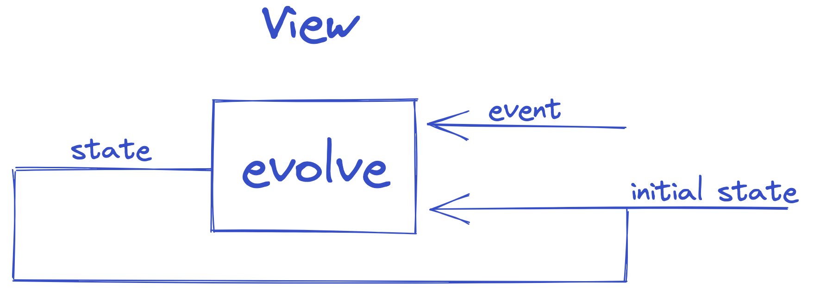

# **f`(`model`)`** - Functional and Reactive Domain Modeling with Java

When you’re developing an information system to automate the activities of the business, you are modeling the business.
The abstractions that you design, the behaviors that you implement, and the UI interactions that you build all reflect
the business — together,
they constitute the model of the domain.

## `IOR<Library, Inspiration>`

This project can be used as a library, or as an inspiration, or both. **It provides just enough tactical
Domain-Driven Design patterns, optimised for Event Sourcing and CQRS.**

- The `domain` module/package is fully isolated from the application layer and API-related concerns. It represents a
  pure
  declaration of the program logic. It is written in Java programming language, without
  additional
  dependencies.
- The `application` module/package orchestrates the execution of the logic by loading state, executing `domain`
  components
  and storing new state. It is written in Java programming language.


## Experimental

**This project is in experimental phase**, and it is not published to Maven Central.

It is using [Amber **productivity-oriented** features](https://openjdk.org/projects/amber/) to accelerate development of
applications:

- records
- sealed hierarchy
- exhaustive pattern matching for Switch expressions

We plan to
use [Project Loom](https://blogs.oracle.com/javamagazine/post/going-inside-javas-project-loom-and-virtual-threads)
within the Application module/package to enable high-throughput lightweight concurrency and new programming models on
the Java platform.

Please refer to [kotlin](https://github.com/fraktalio/fmodel) or [typescript](https://github.com/fraktalio/fmodel-ts)
or [rust](https://github.com/fraktalio/fmodel-rust)
production ready versions of the libraries.

## Decider

`Decider` is a datatype that represents the main decision-making algorithm. It belongs to the Domain layer. It has three
generic parameters `C`, `S`, `E` , representing the type of the values that `Decider` may contain or use.
`Decider` can be specialized for any type `C` or `S` or `E` because these types do not affect its
behavior. `Decider` behaves the same for `C`=`Int` or `C`=`YourCustomType`, for example.

`Decider` is a pure domain component.

- `C` - Command
- `S` - State
- `E` - Event

```java
public record Decider<C, S, E>(BiFunction<C, S, Stream<E>> decide,
                               BiFunction<S, E, S> evolve,
                               Supplier<S> initialState

) implements IDecider<C, S, E> {
}
```


Additionally, `initialState` of the Decider is introduced to gain more control over the initial state of the Decider.
Notice that `Decider` implements an
interface [`IDecider`](src/main/java/com/fraktalio/fmodel/domain/decider/IDecider.java) to communicate the contract.

<details>
  <summary>Example / Test</summary>

```java
class DeciderTest {
  @Test
  void deciderTest() {
    var addOddNumberCommand = new AddOddNumberCommand(1);
    var oddNumberAddedEvent = new OddNumberAddedEvent(1);
    var addEvenNumberCommand = new AddEvenNumberCommand(2);
    var evenNumberAddedEvent = new EvenNumberAddedEvent(2);
    var oddState = new OddNumberState(0);
    var evenState = new EvenNumberState(0);
    var state = new NumberState(evenState, oddState);

    Decider<? super OddCommand, OddNumberState, OddEvent> oddDecider = new Decider<>(
            (c, s) -> switch (c) {
              case AddOddNumberCommand cmd -> Stream.of(new OddNumberAddedEvent(s.value() + cmd.value()));
              case MultiplyOddNumberCommand cmd -> Stream.of(new OddNumberMultipliedEvent(s.value() * cmd.value()));
              case null -> Stream.empty();
            },
            (s, e) -> switch (e) {
              case OddNumberAddedEvent evt -> new OddNumberState(evt.value());
              case OddNumberMultipliedEvent evt -> new OddNumberState(evt.value());
              case null -> s;
            },
            () -> oddState
    );

    Decider<? super EvenCommand, EvenNumberState, EvenEvent> evenDecider = new Decider<>(
            (c, s) -> switch (c) {
              case AddEvenNumberCommand cmd -> Stream.of(new EvenNumberAddedEvent(s.value() + cmd.value()));
              case MultiplyEvenNumberCommand cmd -> Stream.of(new EvenNumberMultipliedEvent(s.value() * cmd.value()));
              case null -> Stream.empty();
            },
            (s, e) -> switch (e) {
              case EvenNumberAddedEvent evt -> new EvenNumberState(evt.value());
              case EvenNumberMultipliedEvent evt -> new EvenNumberState(evt.value());
              case null -> s;
            },
            () -> evenState
    );

    // Combining two deciders into one
    Decider<Command, Pair<EvenNumberState, OddNumberState>, Event> _decider = Decider.combine(
            evenDecider, EvenCommand.class, EvenEvent.class,
            oddDecider, OddCommand.class, OddEvent.class
    );
    // Combining two deciders into one, plus mapping inconvenient `Pair` into a domain specific `NumberState`
    Decider<Command, NumberState, Event> decider = Decider
            .combine(
                    evenDecider, EvenCommand.class, EvenEvent.class,
                    oddDecider, OddCommand.class, OddEvent.class)
            .dimapState(
                    (ns) -> new Pair<>(ns.evenNumber(), ns.oddNumber()),
                    (p) -> new NumberState(p.first(), p.second())
            );

    assertIterableEquals(List.of(oddNumberAddedEvent), oddDecider.decide().apply(addOddNumberCommand, oddState).toList());
    assertIterableEquals(List.of(evenNumberAddedEvent), evenDecider.decide().apply(addEvenNumberCommand, evenState).toList());
    assertIterableEquals(List.of(oddNumberAddedEvent), decider.decide().apply(addOddNumberCommand, state).toList());

    assertEquals(new OddNumberState(1), oddDecider.evolve().apply(oddState, oddNumberAddedEvent));
    assertEquals(new EvenNumberState(2), evenDecider.evolve().apply(evenState, evenNumberAddedEvent));
    assertEquals(new NumberState(new EvenNumberState(0), new OddNumberState(1)), decider.evolve().apply(state, oddNumberAddedEvent));
    assertEquals(new NumberState(new EvenNumberState(2), new OddNumberState(0)), decider.evolve().apply(state, evenNumberAddedEvent));
  }
}

```

</details>

## View

`View`  is a datatype that represents the event handling algorithm, responsible for translating the events into
denormalized state, which is more adequate for querying. It belongs to the Domain layer. It is usually used to create
the view/query side of the CQRS pattern.

It has two generic parameters `S`, `E`, representing the type of the values that `View` may contain or use.
`View` can be specialized for any type of `S`, `E` because these types do not affect its behavior.
`View` behaves the same for `E`=`Int` or `E`=`YourCustomType`, for example.

`View` is a pure domain component.

- `S` - State
- `E` - Event

```java
public record View<S, E>(BiFunction<S, E, S> evolveView,
                         Supplier<S> initialViewState

) implements IView<S, E> {
}
```



Notice that `View` implements an interface [`IView`](src/main/java/com/fraktalio/fmodel/domain/view/IView.java) to
communicate the contract.

<details>
  <summary>Example / Test</summary>

```java
class ViewTest {
  @Test
  void viewTest() {
    var oddNumberAddedEvent = new OddNumberAddedEvent(1);
    var evenNumberAddedEvent = new EvenNumberAddedEvent(2);
    var oddState = new OddNumberState(0);
    var evenState = new EvenNumberState(0);
    var state = new NumberState(evenState, oddState);

    View<OddNumberState, ? super OddEvent> oddView = new View<>(
            (s, e) -> switch (e) {
              case OddNumberAddedEvent evt -> new OddNumberState(evt.value());
              case OddNumberMultipliedEvent evt -> new OddNumberState(evt.value());
              case null -> s;
            },
            () -> oddState
    );

    View<EvenNumberState, ? super EvenEvent> evenView = new View<>(
            (s, e) -> switch (e) {
              case EvenNumberAddedEvent evt -> new EvenNumberState(evt.value());
              case EvenNumberMultipliedEvent evt -> new EvenNumberState(evt.value());
              case null -> s;
            },
            () -> evenState
    );

    // Combining two views into one
    View<Pair<EvenNumberState, OddNumberState>, ? super Event> _decider = View.combine(
            evenView, EvenEvent.class,
            oddView, OddEvent.class
    );
    // Combining two views into one, plus mapping inconvenient `Pair` into more domain specific `NumberState`
    View<NumberState, ? super Event> decider = View
            .combine(evenView, EvenEvent.class, oddView, OddEvent.class)
            .dimapState(
                    (ns) -> new Pair<>(ns.evenNumber(), ns.oddNumber()),
                    (p) -> new NumberState(p.first(), p.second())
            );

    assertEquals(new OddNumberState(1), oddView.evolveView().apply(oddState, oddNumberAddedEvent));
    assertEquals(new EvenNumberState(2), evenView.evolveView().apply(evenState, evenNumberAddedEvent));
    assertEquals(new NumberState(new EvenNumberState(0), new OddNumberState(1)), decider.evolveView().apply(state, oddNumberAddedEvent));
    assertEquals(new NumberState(new EvenNumberState(2), new OddNumberState(0)), decider.evolveView().apply(state, evenNumberAddedEvent));
  }
}

```

</details>

## Saga

`Saga` is a datatype that represents the central point of control, deciding what to execute next (`A`). It is
responsible for mapping different events from many aggregates into action results `AR` that the `Saga` then can use to
calculate the next actions `A` to be mapped to commands of other aggregates.

`Saga` is stateless, it does not maintain the state.

It has two generic parameters `AR`, `A`, representing the type of the values that `Saga` may contain or use.
`Saga` can be specialized for any type of `AR`, `A` because these types do not affect its behavior.
`Saga` behaves the same for `AR`=`Int` or `AR`=`YourCustomType`, for example.

`Saga` is a pure domain component.

- `AR` - Action Result
- `A`  - Action

```java
public record Saga<AR, A>(Function<AR, Stream<A>> react) implements ISaga<AR, A> {
}
```


Notice that `Saga` implements an interface [`ISaga`](src/main/java/com/fraktalio/fmodel/domain/saga/ISaga.java) to
communicate the contract.

<details>
  <summary>Example</summary>

```java

class SagaTest {
  @Test
  void sagaTest() {
    var oddNumberAddedEvent = new OddNumberAddedEvent(1);
    var evenNumberAddedEvent = new EvenNumberAddedEvent(2);
    var addOddNumberCommand = new AddOddNumberCommand(3);
    var addEvenNumberCommand = new AddEvenNumberCommand(2);

    Saga<? super OddEvent, ? extends EvenCommand> oddSaga = new Saga<>(
            (ar) -> switch (ar) {
              case OddNumberAddedEvent evt -> Stream.of(new AddEvenNumberCommand(evt.value() + 1));
              case OddNumberMultipliedEvent evt -> Stream.of(new MultiplyEvenNumberCommand(evt.value() + 1));
              case null -> Stream.empty();
            }
    );

    Saga<? super EvenEvent, ? extends OddCommand> evenSaga = new Saga<>(
            (ar) -> switch (ar) {
              case EvenNumberAddedEvent evt -> Stream.of(new AddOddNumberCommand(evt.value() + 1));
              case EvenNumberMultipliedEvent evt -> Stream.of(new MultiplyOddNumberCommand(evt.value() + 1));
              case null -> Stream.empty();
            }
    );

    // Combining two sagas into one saga
    Saga<? super Event, ? extends Command> saga = Saga.combine(
            oddSaga, OddEvent.class,
            evenSaga, EvenEvent.class
    );

    assertIterableEquals(List.of(addEvenNumberCommand), oddSaga.react().apply(oddNumberAddedEvent).toList());
    assertIterableEquals(List.of(addOddNumberCommand), evenSaga.react().apply(evenNumberAddedEvent).toList());

    assertIterableEquals(List.of(addEvenNumberCommand), saga.react().apply(oddNumberAddedEvent).toList());
    assertIterableEquals(List.of(addOddNumberCommand), saga.react().apply(evenNumberAddedEvent).toList());
  }
}

 ```

</details>

## Requirements

- Java 21

## Driven by Maven

```shell
./mvnw clean verify
```

## Examples

Check [tests](src/test/java/com/fraktalio/fmodel/domain/example)

## Credits

Special credits to `Jérémie Chassaing` for sharing his [research](https://www.youtube.com/watch?v=kgYGMVDHQHs)
and `Adam Dymitruk` for hosting the meetup.

---
Created with :heart: by [Fraktalio](https://fraktalio.com/)